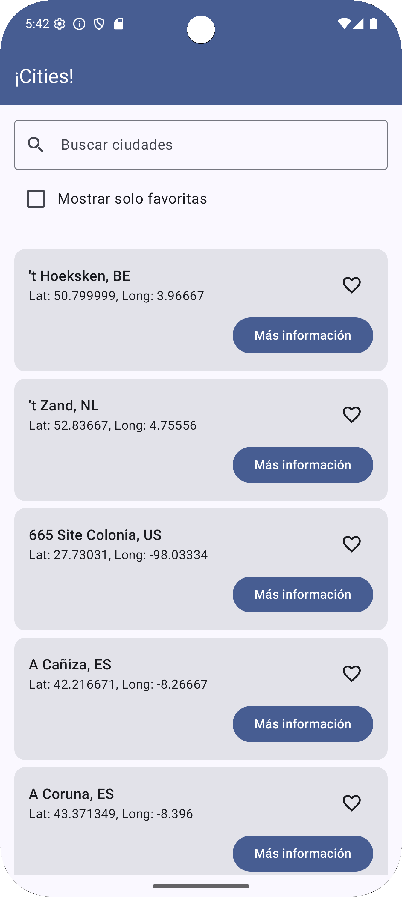
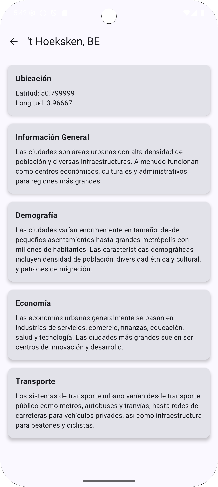
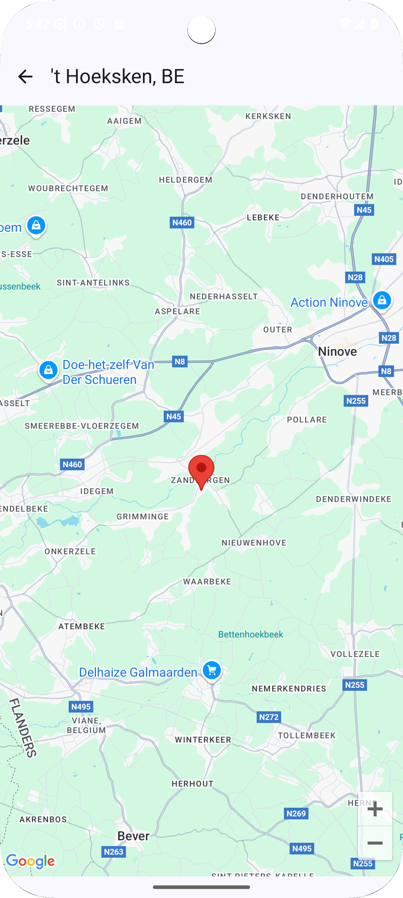
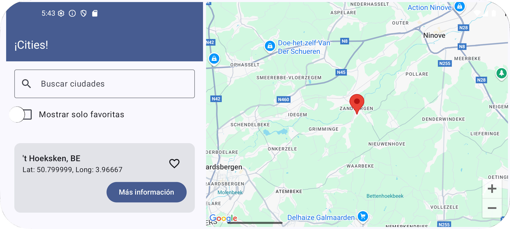

# Cities Challenge

## Descripción
Aplicación Android que muestra un listado de ciudades del mundo, permite buscarlas, marcarlas como favoritas y ver su ubicación en Google Maps. La aplicación está diseñada siguiendo los principios de Clean Architecture y MVVM.

## Características principales
- Visualización de ciudades en una lista ordenada alfabéticamente
- Búsqueda de ciudades por prefijo (case insensitive)
- Marcado de ciudades como favoritas
- Filtrado para mostrar solo ciudades favoritas
- Visualización de ubicación en Google Maps
- Pantalla de información detallada de cada ciudad
- Interfaz adaptativa (vista separada en modo retrato, vista combinada en modo paisaje)
- Optimización para búsquedas rápidas usando Room y FTS (Full-Text Search)

## Enfoque técnico y decisiones clave

Este desafío presentó múltiples variables y escenarios, lo que me llevó a enfrentar problemas relacionados con el uso de memoria, manejo eficiente de datos y la respuesta de la UI. Fue necesario investigar y aplicar buenas prácticas para optimizar el consumo de memoria, la persistencia y consulta de datos en la base de datos, así como el uso adecuado de corrutinas para lograr una experiencia fluida y eficiente. Esta experiencia me permitió profundizar en técnicas de optimización y en el diseño de aplicaciones robustas y escalables en Android.

### Arquitectura y patrones de diseño
- **MVVM y StateFlow**: Se utilizó el patrón MVVM junto con `StateFlow` para gestionar el estado de la aplicación de manera reactiva.
- **Interfaces abstractas**: Se definieron interfaces como `IHomeViewModel` para facilitar las pruebas unitarias y permitir implementaciones alternativas.
- **Single Source of Truth**: Los datos se mantienen en un único punto de verdad, actualizando la UI automáticamente mediante flujos reactivos.
- **Separación de componentes**: Diseño modular con componentes reutilizables (como MapContent) para facilitar mantenimiento y testing.

### Implementación de búsqueda
- **StateFlow reactivo**: La búsqueda se implementa con `StateFlow` para la consulta (`searchQuery`) y el estado de UI (`uiState`), permitiendo actualizaciones en tiempo real.
- **Debounce**: Se aplica debounce al flujo de consulta para evitar búsquedas innecesarias en cada pulsación, ejecutándose solo después de una pausa en la escritura.
- **FTS (Full-Text Search)**: Implementación de búsqueda de texto completo en Room para filtrado eficiente por prefijo, optimizado para grandes volúmenes de datos.

### Experiencia de usuario
- **Diseño adaptativo**: Optimización para diferentes orientaciones usando `detectDisplayType()`, adaptando la experiencia en modos retrato y paisaje.
- **Estados de UI explícitos**: Manejo claro de estados Loading, Error y Success para informar adecuadamente al usuario.
- **Animaciones**: Transiciones suaves en la cámara del mapa y otros elementos visuales para mejorar la experiencia.
- **Persistencia de favoritos**: Almacenamiento local de selecciones del usuario para mejorar la experiencia entre sesiones.

### Rendimiento y optimización
- **Composables eficientes**: Estructura diseñada para minimizar recomposiciones innecesarias y mejorar el rendimiento.
- **Lazy loading**: Carga eficiente de elementos en listas para optimizar rendimiento y consumo de memoria.
- **Gestión de recursos**: Liberación adecuada de recursos pesados como la API de Google Maps.
- **Filtrado optimizado**: Estrategias eficientes para filtrado de datos, considerando el volumen manejable de información.

## Preprocesamiento para búsquedas eficientes

Para optimizar las búsquedas de ciudades en la aplicación, se implementó una estructura especializada utilizando **Room con FTS4 (Full-Text Search)**. Esta decisión proporciona varias ventajas significativas:

- **Índices optimizados**: FTS crea índices invertidos que permiten búsquedas por prefijo extremadamente rápidas, incluso con miles de ciudades.
- **Menor consumo de memoria**: Al delegar la búsqueda a SQLite, evitamos cargar y filtrar todas las ciudades en memoria cada vez.
- **Operaciones asíncronas**: Las consultas FTS se ejecutan en un hilo separado mediante corrutinas, manteniendo la UI responsiva durante las búsquedas.
- **Match parcial eficiente**: Búsqueda por prefijos parciales sin necesidad de recorrer toda la colección.

Esta implementación resultó considerablemente más eficiente que alternativas como:
- Filtrado en memoria con `.filter()` o `.contains()`
- Uso de estructuras como HashMap o TreeMap
- Algoritmos de búsqueda personalizados

Las pruebas mostraron un rendimiento superior especialmente en dispositivos con recursos limitados y con grandes volúmenes de datos.

### Manejo de datos
- **Caché local**: Estrategia de almacenamiento local para reducir llamadas a la red y permitir uso offline.
- **Transformación de modelos**: Mapeo claro entre modelos de datos, dominio y presentación siguiendo principios de Clean Architecture.

### Testing
- **Previews de Compose**: Uso extensivo de @Preview para verificación visual de componentes sin ejecutar la aplicación completa.
- **Abstracción para testabilidad**: Interfaces y clases abstractas que facilitan la creación de mocks para pruebas unitarias.
- **Pruebas unitarias**: Implementación de pruebas para modelos, repositorios y casos de uso, asegurando la calidad del código y la funcionalidad.

## Arquitectura
El proyecto sigue los principios de **Clean Architecture** con tres capas principales:
- **Presentación**: Compose UI, ViewModels
- **Dominio**: Casos de uso, modelos de dominio, interfaces de repositorio
- **Datos**: Implementaciones de repositorio, fuentes de datos (API y local)

## Tecnologías y bibliotecas
- **Kotlin** como lenguaje principal
- **Jetpack Compose** para la UI
- **Coroutines** y **Flow** para operaciones asíncronas
- **Hilt** para inyección de dependencias
- **Retrofit** para comunicación con la API
- **Room** para persistencia local
- **Google Maps** para visualización de mapas
- **JUnit** y **Mockito** para pruebas unitarias

## Funcionalidades destacadas
- **Búsqueda optimizada**: Implementación eficiente con índices en SQLite y filtrado por prefijo
- **Interfaz adaptativa**: Diseño que se ajusta a la orientación del dispositivo
- **Previsualización de Composables**: Funcionalidad para previsualizar componentes sin depender de Hilt
- **Gestión de estados UI**: Implementación robusta de estados (Loading, Error, Success)
- **Manejo centralizado de errores**: Sistema unificado para mensajes de error

## Configuración del proyecto
1. Clonar el repositorio
2. Añadir tu API Key de Google Maps en el archivo `local.properties`:
   ```
   MAPS_API_KEY=tu_api_key_aquí
   ```
3. Sincronizar el proyecto con Gradle
4. Ejecutar la aplicación

## Posibles mejoras futuras
- Añadir animaciones más elaboradas
- Añadir soporte para múltiples idiomas
- Añadir test para ViewModels
- Añadir un sistema de notificaciones para actualizaciones de ciudades
- Implementar caché con expiración para los datos
- Implementar modo oscuro
- Implementar pruebas de integración y UI tests con Espresso
- Implementar un sistema de autenticación para usuarios

## Screenshots
| Pantalla Principal | Detalle de Ciudad | Mapa | Landscape |
|--------------------|-------------------|------|-----------|
|  |  |  |  |

---
